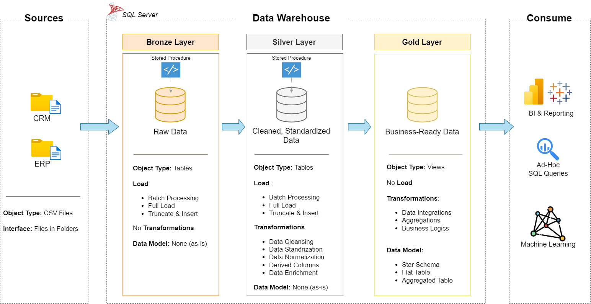

# SQL-Datawarehouse-Project01
Building a Modern Data Warehouse with AQL server, including ETL process, Data modeling and Analytics
Welcome to the --Data Warehouse & Analytics project--  Repo

This project demonstrate a comprehensive Data warehousing and analytics solution, from building a data warehouse to generating actionable insights. Designed as a portfolio project, it highlight industry best practice in Data Engineering and Analytics.

##  Data Architecture

The data architecture for this project follows Medallion Architecture **Bronze**, **Silver**, and **Gold** layers:

1. **Bronze Layer**: Stores raw data as-is from the source systems. Data is ingested from CSV Files into SQL Server Database.
2. **Silver Layer**: This layer includes data cleansing, standardization, and normalization processes to prepare data for analysis.
3. **Gold Layer**: Houses business-ready data modeled into a star schema required for reporting and analytics.

---
## Project Overview

This project involves:

1. **Data Architecture**: Designing a Modern Data Warehouse Using Medallion Architecture **Bronze**, **Silver**, and **Gold** layers.
2. **ETL Pipelines**: Extracting, transforming, and loading data from source systems into the warehouse.
3. **Data Modeling**: Developing fact and dimension tables optimized for analytical queries.
4. **Analytics & Reporting**: Creating SQL-based reports and dashboards for actionable insights.
